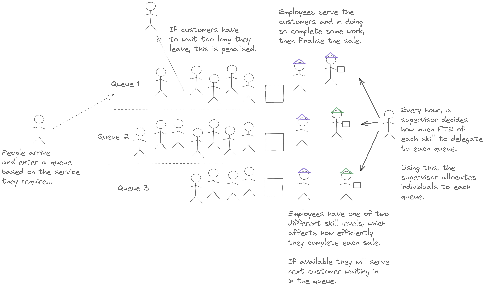
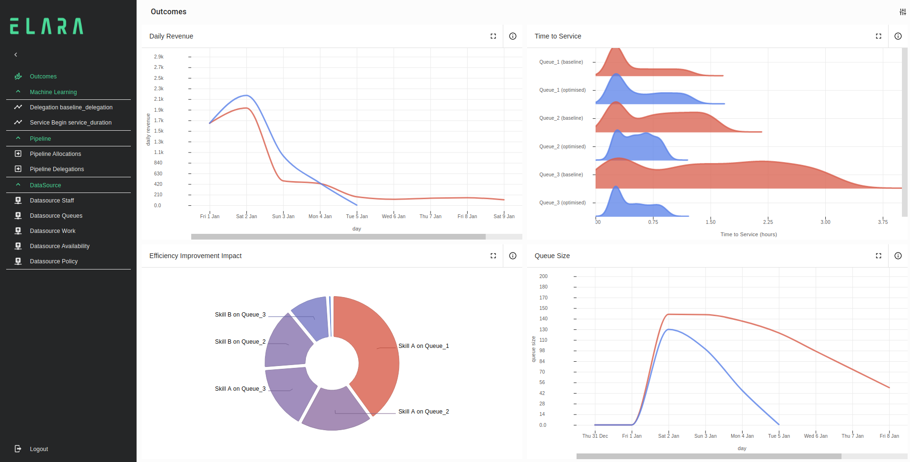

# Overview

Example solution that demonstrates the optimization of a non-trivial queuing process by recommending dynamic priorities for the delegation of servers to queues.

# Modelling Detail

## Queue Model Details

The model is representative of a queueing process with multiple servers per queue, the following diagram describes the model:

. 

Each server may only work on one item at a time and will exclusively work on items that arrive in the queue to which they have been delegated for a time interval. Each queue acts as a first in first out (FIFO) queue. 

The time of entry for work into the queue is generated via sampling from an inhomogeneous poisson process where the rate varies as a function of time for each queue in an unknown fashion.

When an item enters the queue, if the queue is empty and the servers are free the work will be performed immediately by a random staff member. If the servers are busy or there are items in the queue already the item will stay in the queue until all previous items have been served. 

Work in each queue will spontaneously exit the queue after a time interval if no servers have been assigned to the queue in the time interval in which they arrived.

Once an item has made it to the front of the queue they will be served by the next available server.

Each queue/employee qualification level combination has a stochastic service duration that will be learnt as part of the model via ELARA's ML modelling capabilities.

At the end of service the business will be paid cash of each item.

## Employee Availability and Delegation Details

The model assumes that there is a plan for a list of employees who will be available at each time interval that the simulation runs (i.e. a work schedule).

The model then has two inference problems to solve
- A Forward Prediction Model for an Implicit Delegation Strategy: If there is a historical record of which employees were assigned to which queue in the past, can we learn this strategy so that future performance can be predicted?
- An Optimised Delegation Strategy: Can we develop a dynamic strategy for delegation that will improve the expected performance of the queueing process compared to the historic strategy.

## Quantifying Performance

To develop an optimal strategy a target needs to be set for this process. This is quantified by setting three optimisation targets within the model
- Maximise cash
- Minimise time spent in queue
- Minimise number of non service events (where queue items spontaneously exit the queue due to lack of service)

Since (for this simplified model) each item has the same service value, it is not strictly necessary to maximise cash, since the other two minimisation target will also cover this objective. It has just been included for completeness and ease of extension to more sophisticated modelling scenarios. 

## Usage

Run `npm install` to install the package dependencies.

Run `edk build` to create the `schema.json`.

# Implementation
The project will involve creating some file based datasources, use these to build some structure instances.

## Raw Data
The raw data consists of following files
- availability.csv: A tabular list of all staff who were available for each queue in each hour
- policy.csv: A tabular list of the default parameters for the employee delegation strategy 
- queues.csv: A list of the named queues present in the simulation
- staff.csv: A list of the staff and their employee type 
- work.csv:  A tabular list of all the transactions, this includes fields for time of queue arrival, queue departure, service duration, employee id. 

A special "predict" boolean is also used to denote which transactions are virtual and which are historic, full details will be provided below for each datasource.

## Adding Datasources
The csv data sources were added with the following commands: 

### Availability
The "Availability" dataset is the employee schedule. This list contains a row when a particular employee will be available for each hour. The following commands were used to created and detect the datasource:
- `edk add datasource csv --name "Availability" --def_dir "src/datasource" --file "data/availability.csv"`
- `edk-io detect csv --asset "availability.source"`

### Policy
The "Policy" dataset is a default collection of parameters for how the optimal delegation of count of employee type per queue should be calculated. This was obtained via a short run of offline optimisation. This list contains a row when a particular employee will be available for each hour. The following commands were used to created and detect the datasource:
- `edk add datasource csv --name "Policy" --def_dir "src/datasource" --file "data/policy.csv"`
- `edk-io detect csv --asset "policy.source"`

### Queues
The "Queues" dataset simply contains the list of queues. The following commands were used to created and detect the datasource:
- `edk add datasource csv --name "Queues" --def_dir "src/datasource" --file "data/queues.csv"`
- `edk-io detect csv --asset "queues.source"`

### Staff
The "Staff" dataset contains the list of salary employed staff in the business. Each staff member has a qualification level. The following commands were used to created and detect the datasource:
- `edk add datasource csv --name "Staff" --def_dir "src/datasource" --file "data/staff.csv"`
- `edk-io detect csv --asset "staff.source"`

### Work
The "Work" dataset contains records of people arriving into a queue to be pay for and be provided some service, so including their arrival time in the queue, the time they are finally served, as well as the duration of service. The following commands were used to created and detect the datasource:
- `edk add datasource csv --name "Work" --def_dir "src/datasource" --file "data/work.csv"`
- `edk-io detect csv --asset "work.source"`

## Add Pipelines

### Allocation
The availability record contains an implicit representation of which employees have been and will be available for work each hour. For convenience this dataset can be transformed into an hourly record of the set of employees who will be available, rather than a record per staff member per hour as present in the original dataset.
- `edk add pipeline --name "Allocation Parameters" --def_dir src/pipeline`

### Delegations
The availability record also contains an implicit representation of how employees have historically been delegated to queues (since each record contains the queue id and employee id). This dataset can be conveniently transformed into an hourly record of the level of each staff type present on each queue (as a dictionary) 
- `edk add pipeline --name "Delegations" --def_dir src/pipeline`

## Add scenarios
In order to apply an `Option` we need to add a scenario. As previously stated we are interested in two scenarios
- A baseline scenario where the historic delegation strategy is learned from data
- An optimsied scenario where a mode optimal delegation strategy is explored.
  
These are added with the following commands: 
- `edk add scenario --name baseline --def_dir src/scenario`
- `edk add scenario --name optimised --def_dir src/scenario`

## Add resources
As this is a sophisticated demo, a full break down of each structural element's creation will not be given (as there will be a great deal of overlap with previous examples), instead focus will be drawn to the important properties that allow this simulation to be developed.
First we can create a resources to track incoming queue items and business state, with the following commands: 
- `edk add structure resource --concept "Employees" --def_dir src/structure/resource`
- `edk add structure resource --concept "Mode" --def_dir src/structure/mode`
- `edk add structure resource --concept "Money" --def_dir src/structure/resource`
- `edk add structure resource --concept "Policy" --def_dir src/structure/resource`
- `edk add structure resource --concept "Queue Items" --def_dir src/structure/resource`
- `edk add structure resource --concept "Queues" --def_dir src/structure/resource`

These commands will create empty resources. There are created via a mapping from datasources for the following resources

- Employees   -> Staff Datasource
- Policy      -> Policy Datasource
- Queue Items -> Work Datasource
- Queues      -> Queue Datasource

Whereas the Money and Mode resources are special instances. 

### Money

The money keeps track of the balance of cash as a temporal resource. The cash balance is tagged as an objective with various sampling statistics to be calculated, as seen below 

```typescript
import * as ELARA from "@elaraai/edk/lib"

import { Resource } from "@elaraai/edk/lib"

export default ELARA.ResourceStructureSchema({
    concept: "Money",
    instances: {
        cash: Resource({
            properties: {
                balance: ELARA.Temporal({
                    initial_value: 0,
                    sampling_unit: "hour",
                    sampling_statistic: {
                        "median":'p50',
                        "upper": 'p85',
                        "lower": 'p15'
                    },
                    objective: ELARA.Property("balance", "float")
                })
            }
        })
    }
})
```

### Mode

The mode is a special resource to allow for switching between simulation modes based on which scenario is active. This can been seen by using the proposals for the `Option` Boolean property called `optimised` based on the scenario, as seen below.

```typescript
import * as ELARA from "@elaraai/edk/lib"

import { Option, Resource } from "@elaraai/edk/lib"

import baseline_scenario from "../../../gen/baseline.scenario"
import optimised_scenario from "../../../gen/optimised.scenario"

export default ELARA.ResourceStructureSchema({
    concept: "Mode",
    instances: {
        allocation: Resource({
            properties: {
                date: new Date("2021-01-02T00:00:00.000Z"), // Seperates "past" from "future"
                optimise: Option({
                    default_value: false,
                    proposals: [
                        { scenario: baseline_scenario, value: false },
                        { scenario: optimised_scenario, value: true }
                    ],
                    date: Property("date", "datetime"),
                })
            }
        })
    }
})
```

### Queue

The two most important queue properties are:

- queue_items
  this keeps track of a temporal set of markers for the work that is currently in the queue. 

- employees
  this keeps track of the set of empoyee markers currently delegated to this queue
  
The other properties are convenience properties for keeping track of hourly aggregates of work entering and exiting the queues and queue state variables.

### Employees

The two properties of employees are 
- next_available_time: If an employee is currently busy, this variable keeps track of when they will next become free.
- availability: In this model employees are assigned a "backlog" of work to be performed. This property is an integer starting at 1 that will be decremented for each item they commit to serving. A staff members availability can be checked by seeing if this variable is less than or equal to 0.

### Policy

The policy resource contains `Options` that allow for the optimal scenario to be examined. They also contain perturbations for duration to explore with queue/empoyee type combination is causing most delay. The model for optimal delegation will be outlined in the delegation process but is based on an affine model with a rate that depends on the number of work items seen entering the queue in the last hour and a bias term for each empoyee type/queue combination.  The setup for the automatic and sensitivity options in each scenario can be seen below:

```typescript
import * as ELARA from "@elaraai/edk/lib"
import { Option } from "@elaraai/edk/lib"

import policy_source from "../../../gen/policy.source"
import baseline_scenario from "../../../gen/baseline.scenario"
import optimised_scenario from "../../../gen/optimised.scenario"

const policy = policy_source.output

export default ELARA.ResourceStructureSchema({
    concept: "Policy",
    mapping: {
        input_table: policy,
        properties: {
            date: new Date("2021-01-02T00:00:00.000Z"), // Seperates "past" from "future"
            queue: policy.fields.Queue,
            type: policy.fields.Type,
            bias: Option({
                default_value: policy.fields.Bias,
                automatic: [
                    {
                        scenario: optimised_scenario,
                        min: policy.fields.BiasMin,
                        max: policy.fields.BiasMax
                    },
                ],
                date: Property("date", "datetime"),
            }),
            queue_load: Option({
                default_value: policy.fields.Load,
                automatic: [
                    {
                        scenario: optimised_scenario,
                        min: policy.fields.LoadMin,
                        max: policy.fields.LoadMax
                    },
                ],
                date: Property("date", "datetime"),
            }),
            duration_perturbation: Option({
                default_value: 0,
                sensitivity: [
                    {
                        scenario: baseline_scenario,
                        min: 0,
                        max: 120
                    },
                ],
                date: Property("date", "datetime"),
            })
        },
    }
})
```

### Queue Items

A Resource that is a simple mapping from the work datasource into resource instances. Service time is kept as a convenient temporal property

## Add processes
Next we create the various processes to transform the state of the various resources listed above, with the following commands: 
- `edk add structure process --concept "Arrival" --def_dir src/structure/process`
- `edk add structure process --concept "Availability" --def_dir src/structure/process`
- `edk add structure process --concept "Delegation" --def_dir src/structure/process`
- `edk add structure process --concept "Sale" --def_dir src/structure/process`
- `edk add structure process --concept "Service Begin" --def_dir src/structure/process`
- `edk add structure process --concept "Service End" --def_dir src/structure/process`

A break down of each process is given below with the important functions highlighted

### Arrival

A simple process that takes the work datasource and enqueues the work into the appropriate queue at the arrival time and updates the convenience properties (like queue size). Note how an item is added to the temporal set for queue items via the following method. This pattern of updating a set Via a `Union` follwed by a `NewSet` is repeated at various places throughout the model.

```typescript
/// ...
events: {
    // add to the appropriate queue
    enqueue: {
        property: queues.properties.queue_items,
        marker: work_source.output.fields.Queue,
        value: Union(
            Property("queue_items", "set"),
            NewSet(work_source.output.fields.ID)
        ),
    },
}
/// ...
```

### Availability

Another simple process whose main function is to reset the availability of queue staff at each time interval. The set of staff available is provided directly to the delegation process. 

### Delegation

This process set the set of employees to each queue at a regular time interval set by the delegations pipeline. This has a coincident timing as the availability process. The availability process resets the set of queue staff, this process takes the set of available staff and assigns them to queues.
The first step is to find the current set of staff who have not been allocated to queues. This is performed by getting the whole set of employees, the set of employees who have currently been allocated to queues and looking the set difference, as shown in the code snippet below

```typescript
/// ...
all_employees_types: GetProperties({
    property: employees.properties.type
}),
all_employees: Keys(Property("all_employees_types", DictType("string"))),
//get the employees currently delegated to the all queues
queue_allocated_employees: GetProperties({
    property: queues.properties.employees,
}),
//get the current set of allocated employees
current_allocated_employees: UnionAll(Property("queue_allocated_employees", DictT("set"))),
//collect a set of unallocated employees
unallocated_employees: SetDiff(
    Property("all_employees", "set"),
    Property("current_allocated_employees", "set"),
),
/// ...
```

The next task is to allocate the unallocated employees until a certain level of each empoyee type is reached, or there are no more employees to delegate. The property that holds this level is called `employee_delegation` and is dictionary with an employee type as a key and the desired staff count as a value. This delegation is performed by the following reduce statement.

```typescript
/// ...
//greedily delegate unallocated employees to delegation limit 
//set by employee delegation property
allocated_employees: Reduce(
    Property("unallocated_employees", "set"),
    //reducer
    IfElse(
        LessEqual(
            Add(
                Replace(
                    Get(
                        GetField(Variable("Previous", allocated_type), "TypeCount"),
                        Get(
                            Property(
                                "all_employees_types",
                                DictType("string")
                            ),
                            Variable("value", "string")
                        ),
                    ),
                    null,
                    0
                ),
                1
            ),
            Round(
                Replace(
                    Get(
                        Property("employee_delegation", DictType("float")),
                        StringJoin`${Property("queue", "string")
                            }.${Get(
                                Property("all_employees_types", DictType("string")),
                                Variable("value", "string")
                            )
                            }`
                    ),
                    null,
                    0
                ),
            ),
        ),
        Struct({
            Employees: Union(
                GetField(Variable("Previous", allocated_type), "Employees"),
                NewSet(
                    Variable("value", "string")
                )
            ),
            TypeCount: Insert(
                GetField(Variable("Previous", allocated_type), "TypeCount"),
                Get(
                    Property(
                        "all_employees_types",
                        DictType("string")
                    ),
                    Variable("value", "string")
                ),
                Add(
                    Replace(
                        Get(
                            GetField(Variable("Previous", allocated_type), "TypeCount"),
                            Get(
                                Property(
                                    "all_employees_types",
                                    DictType("string")
                                ),
                                Variable("value", "string")
                            ),
                        ),
                        null,
                        0
                    ),
                    1
                )
            )
        }),
        //Done allocating
        Variable("Previous", allocated_type),
    ),
    //initial
    Struct({
        Employees: NewSet(),
        TypeCount: NewDict("float")
    }),
    // previous
    Variable("Previous", allocated_type),
    // value
    Variable("value", "string"),
),
/// ...
```

The last issue is to set the dictionary `employee_delegation`. Under the baseline scenario this is set by an `MLFunction` learnt on the historical delegations, as below

```typescript
/// ...
baseline_delegation: MLFunction({
    value: delegations.fields.EmployeeTypes,
    features: {
        hour: Property("hour", "integer"),
        employee_count: Property("employee_count", "integer")
    },
    train: Not(delegations.fields.Predict),
    predict: delegations.fields.Predict,
}),
/// ...
```

Otherwise in the optimised scenario it is a linear model based on the queue and type and queue load (number of new queue items in the last time interval). This is shown below:

```typescript
/// ...
optimised_delegation: IfElse(
    delegations.fields.Predict,
    Reduce(
        Property("types_of_employees", "set"),
        Insert(
            Variable("Previous", DictType("float")),
            StringJoin`${Property("queue", "string")}.${Variable("key", "string")}`,
            Max(
                Add(
                    Get(
                        Property("bias_parameters", DictType("float")),
                        StringJoin`${Property("queue", "string")}.${Variable("key", "string")}`
                    ),
                    Multiply(
                        Get(
                            Property("queue_load_parameters", DictType("float")),
                            StringJoin`${Property("queue", "string")}.${Variable("key", "string")}`
                        ),
                        Property("new_queue_arrivals", "integer")
                    ),
                ),
                0
            ),
        ),
        //initial
        NewDict("float"),
        // previous
        Variable("Previous", DictType("float")),
        Variable("key", "string")
    ),
    delegations.fields.EmployeeTypes,
),
/// ...
```

### Service Begin

Now that employees are allocated to queues, we need to see which piece of work in the queue will fall to which employee. This is performed in the Service Begin process. An important point to note is that in every service case the minimum time at which work can be performed is the time of queue entry (i.e. if the queue is empty and a staff member is delegated to the queue and not currently busy the service can begin immediately). So the date at which this process initiates is this time. The first task is to see if any staff member is free to work (if there are previous queue items the server will not be free so it is not necessary to queue the queue state here, however if non FIFO behaviour is desired then more sophisticated logic is required). This is achieve by looking at the state of queue employees availability. The maximum value of this state will determine if any staff are free. This is achieved via the following cope snippet:

```typescript
max_availability: Replace(MaxAll(Property("queue_employee_availability", DictType("integer"))), null, -1n),
```

We are also interested in the time the the staff will next be free to serve (in the case that none are available). This is achieved via the following code snippet:

```typescript
/// ...
next_available_staff: Reduce(
    //collection
    Property("queue_employee_available_times", DictType("datetime")),
    //reducer
    IfElse(
        And(
            LessEqual(
                Get(
                    Property("queue_employee_availability", DictType("integer")),
                    Variable("marker", "string"),
                ),
                0n
            ),
            IfElse(
                IsNull(GetField(Variable("Previous", next_available_type), "Date")),
                true,
                Less(
                    GetField(Variable("Previous", next_available_type), "Date"),
                    Variable("date", "datetime"),
                ),
            ),
        ),
        Struct({
            Marker: Variable("marker", "string"),
            Date: Variable("date", "datetime")
        }),
        Variable("Previous", next_available_type),
    ),
    // initial (init and prev same type!!!! (return type of func))
    Struct({
        Marker: Null("string"),
        Date: Null("datetime")
    }),
    // previous
    Variable("Previous", next_available_type),
    // value
    Variable("date", "datetime"),
    // key
    Variable("marker", "string")
),
/// ...
```

This will return a struct with the marker and time of the staff member who will exit service next.

We then choose the staff member who is next available to work, or otherwise a random staff member who is free, as follows

```typescript
/// ...
service_staff: IfElse(
    work_source.output.fields.Predict,
    IfElse(
        LessEqual(Property("max_availability", "integer"), 0n),
        GetField(Property("next_available_staff", next_available_type), "Marker"),
        Property("random_available_staff", "string")
    ),
    work_source.output.fields.StaffID
),
/// ...
```

where `random_available_staff` is found by

```typescript
/// ...
random_available_staff: Random({
    distribution: "set",
    set: Property("available_staff", "set")
}),
/// ...
```

Once a staff member is allocated to the work we sample from a leanred ML model for how long the service is likely to take, via

```typescript
/// ...
service_duration: MLFunction({
    value: work_source.output.fields.Duration,
    features: {
        "Staff Type": Property("staff_type", "string"),
        "Queue": Property("queue", "string")
    },
    train: Not(work_source.output.fields.Predict),
    predict: work_source.output.fields.Predict,
}),
/// ...
```

We also perturb this duration to see the effect of queue throughput (which queue/staff combinations are most sensitive to disruption).

```typescript
/// ...
parameter_name: StringJoin`${Property("queue", "string")}.${Property("staff_type", "string")}`,
//add extra duration as a sensitivity perturbation
service_duration_perturbation: GetProperty({
    property: policy.properties.duration_perturbation,
    marker: Property("parameter_name", "string")
}),
/// ...
```

We can now get the dequeue time and we also must handle the case (as may occur in poor allocation strategies) of no staff members being available to serve to work item. For this we include a spontaneous exit process as below, penalised as an objective:

```typescript
/// ...
service_dequeue_time: IfElse(
    work_source.output.fields.Predict,
    IfElse(
        LessEqual(Property("max_availability", "integer"), 0n),
        GetField(Property("next_available_staff", next_available_type), "Date"),
        Property("queue_arrival_time","datetime")
    ),
    work_source.output.fields.ServiceTime
),
//Handle case of no service -> person jumps off queue
not_served: GenericFunction({
    expression:IsNull(
        Property("service_dequeue_time", "datetime")
    ),
    objective: IfElse(
        Property("not_served", "boolean"),
        Const(-10000),
        Const(0),
    )
}),
/// ...
```

So we are now in possession of which staff member serves, when the work will exit the queue, and how long the service will take (handling the case of null delegations). We use these to update the model states the Service End and Sale processes

### Service End
Service End is a simple process with the main function of updating the queue (removing the work at the appropriate time) and removing the availability and busy time of the service employee.

### Sale
Sale is another simple process that updates cash and frees up the employee's availability as the service is now complete.

## Add analytics
In order to create a custom dashboard showing the outcomes, plugins were created to prepare the data, using the following commands:
- `edk add plugin --name Pipelines --def_dir src/analytics`
- `edk add plugin --name Simulation --def_dir src/analytics`
- `edk add plugin --name Views --def_dir src/analytics`

### Simulation results

First the simulation results were configured for sales, queues and service being, to use in the application (for simplicity all properties are used):

```typescript
import { Schema, SimulationPlugin, mergeSchemas } from '@elaraai/edk/lib';

import queues from '../../gen/queues.structure'
import service_begin from '../../gen/service_begin.structure'
import sale from "../../gen/sale.structure"

export default Schema(
    mergeSchemas(
        SimulationPlugin({
            name: "Sale Simulation",
            entity: sale,
            properties: sale.properties,
            marker: 'marker'
        }),
        SimulationPlugin({
            name: "Queue Simulation",
            entity: queues,
            properties: queues.properties,
            marker: 'marker',
            ml: false
        }),
        SimulationPlugin({
            name: "Service Begin Simulation",
            entity: service_begin,
            marker: 'marker',
            properties: service_begin.properties,
            ml: false,
        }),
    )
)
```

### Pipelines
Next pipelines were created to shape the data for use in the application, for example we can create a pipeline that calculates the probability distribution for each combination of queue and scenario for comparison:

```typescript
/// ....
PipelineSchema({
    name: "Wait Duration",
    input_table: service_begin_simulation,
    operations: [
        FilterOperation({
            predicate: service_begin_simulation.fields.predict
        }),
        DistributionOperation({
            samples: service_begin_simulation.fields.queue_duration,
            group_key: StringJoin`${service_begin_simulation.fields.queue} (${service_begin_simulation.fields.scenario})`,
            distribution: 'GaussianKDE',
            normalization: 'PercentSum',
            n_bins: 400n,
        }),
        SelectOperation({
            keep_all: true,
            selections: {
                value: Divide(Variable('value', 'float'), 3600),
                color: IfElse(
                    RegexContains(Variable('group', 'string'), baseline.name),
                    Const(colors.Red),
                    Const(colors.Blue)
                )
            }
        })
    ]
}),
/// ....
```

### Views
Finally views are created to apply in page visuals, such as a grouped and sorted view for the revenue per day.:

```typescript
/// ...
ViewSchema(
    View({
        name: 'Sales',
        partition: sales.partitions.all,
        table: sales,
        keep_all: false,
        groups: {
            scenario: ViewGroup({ value: sales.fields.scenario, dir: 'asc'}),
            date: ViewGroup({ value: Floor(sales.fields.date, 'day'), dir: 'asc'}),
        },
        aggregations: {
            "daily revenue": Sum(sales.fields["daily revenue"]),
            color: Unique(sales.fields.color),
            day: Unique(sales.fields.day),
        }
    })
),
/// ...
```

## Add application
The application was added for the project with the following command: ```edk add plugin --name Application --def_dir src/plugin```. The application contents was added to display the a custom page with `Daily Revenue`, `Time to Service`, `Efficiency Improvement Impact` and `Queue Size`:

```typescript
/// ...
Outcomes: PanelPageSchema({
    name: "Outcomes",
    icon: 'finance',
    // note the nested containers, the containers may configured like a nested flex layout, units for PanelDimension default to %.
    container: PanelContainer({
        size: PanelDimension({ size: 100 }),
        orientation: 'column',
        items: [
            PanelContainer({
                size: PanelDimension({ size: 50 }),
                orientation: 'row',
                items: [
                    PanelVisual({
                        name: "Daily Revenue",
                        size: PanelDimension({ size: 50 }),
                        // draw a custom line chart
                        visual: GroupLineVisual({
                            series: GroupLineValueSeries({
                                view: sales,
                                x: sales.aggregations.day,
                                y: sales.aggregations['daily revenue'],
                                key: sales.groups.scenario,
                                curve: 'curve_monotone_x',
                                color: GroupFixedColor(sales.aggregations.color),
                                tooltip: Tooltip({
                                    title: StringJoin`${sales.fields.scenario} sales`,
                                    values: {
                                        'daily revenue': sales.fields['daily revenue'],
                                        day: sales.fields.day,
                                    }
                                })
                            })
                        })
                    }),
                    PanelVisual({
                        name: "Time to Service",
                        size: PanelDimension({ size: 50 }),
                        // draw a custom ridgeline chart
                        visual: RowRidgelineVisual({
                            series: RowRidgelineSeries({
                                view: wait_duration,
                                x: wait_duration.fields.value,
                                z: wait_duration.fields.probability,
                                z_overlap: 0.1,
                                curve: 'curve_monotone_x',
                                color: RowFixedColor(wait_duration.fields.color),
                                tooltip: Tooltip({
                                    title: StringJoin`${wait_duration.fields.group} duration`,
                                    values: {
                                        duration: wait_duration.fields.value,
                                        percentage: wait_duration.fields.probability,
                                    }
                                })
                            }),
                            layout: Layout<'float', 'string'>({
                                xaxis: XAxis({ type: 'float', ticks: { min: 0 }, title: { text: "Time to Service (hours)" } }),
                                yaxis: YAxis({ type: 'string', ticks: { size: 120 } }),
                            }),
                        })
                    }),
                ],
            }),
            PanelContainer({
                size: PanelDimension({ size: 50 }),
                orientation: 'row',
                items: [
                    PanelVisual({
                        size: PanelDimension({ size: 50 }),
                        name: "Efficiency Improvement Impact",
                        // draw a custom pie chart
                        visual: GroupPieVisual({
                            series: GroupPieSeries({
                                view: efficiency_improvement_impact,
                                x: efficiency_improvement_impact.groups.focus,
                                value: efficiency_improvement_impact.aggregations.impact,
                                color: GroupLinearColor(efficiency_improvement_impact.aggregations.impact, [colors.Blue, colors.Red]),
                                tooltip: Tooltip({
                                    title: StringJoin`${efficiency_improvement_impact.fields.focus}`,
                                    values: {
                                        queue: efficiency_improvement_impact.fields.queue,
                                        skill: efficiency_improvement_impact.fields.skill,
                                        impact: efficiency_improvement_impact.fields.impact,
                                    }
                                })
                            }),
                        })
                    }),
                    PanelVisual({
                        name: "Queue Size",
                        size: PanelDimension({ size: 50 }),
                        // draw another line chart
                        visual: GroupLineVisual({
                            series: GroupLineValueSeries({
                                view: queue_size,
                                x: queue_size.aggregations.day,
                                y: queue_size.aggregations['queue size'],
                                key: queue_size.groups.scenario,
                                curve: 'curve_monotone_x',
                                color: GroupFixedColor(queue_size.aggregations.color),
                                tooltip: Tooltip({
                                    title: StringJoin`${queue_size.fields.scenario} sales`,
                                    values: {
                                        'queue size': queue_size.fields['queue size'],
                                        day: queue_size.fields.day,
                                    }
                                })
                            })
                        })
                    }),
                ],
            })
        ],
    }),
    grants: [],
}),
/// ...
```

The page will allow comparison between baseline (red) and optimized (blue) scenarios:



## Reference
General reference documentation for EDK usage is available in the following links:
- [EDK CLI reference](https://elaraai.github.io/docs/cli/cli): detailed CLI usage reference and examples
- [EDK API reference](https://elaraai.github.io/docs/api): programmatic api for the cli functionality